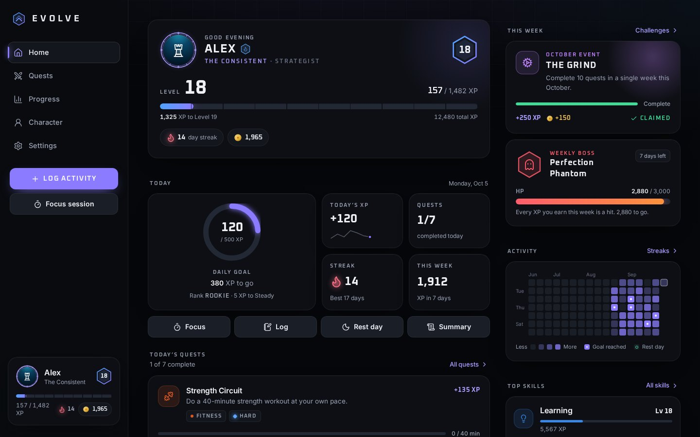
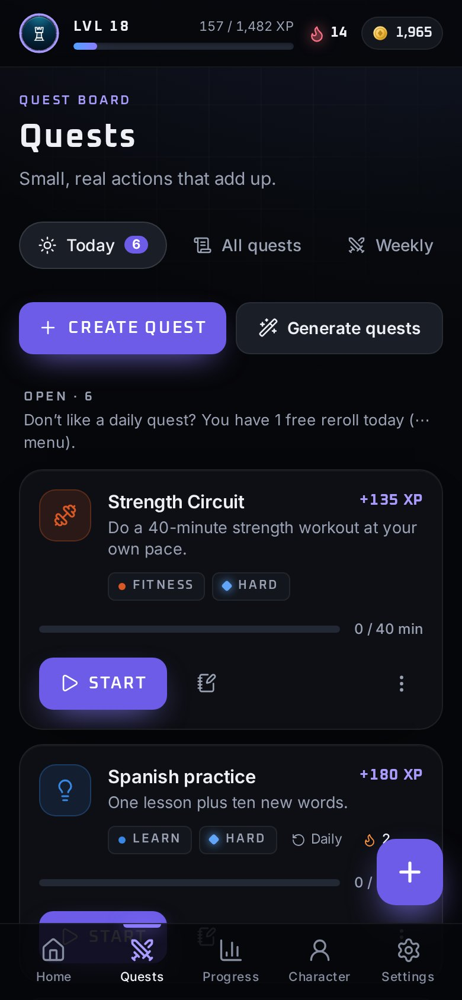
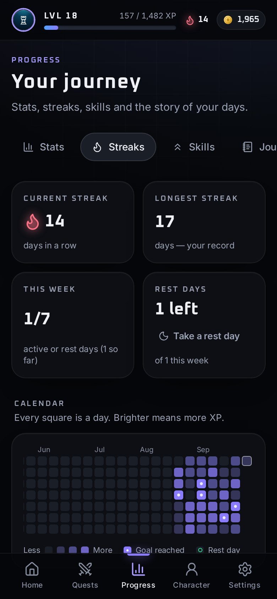
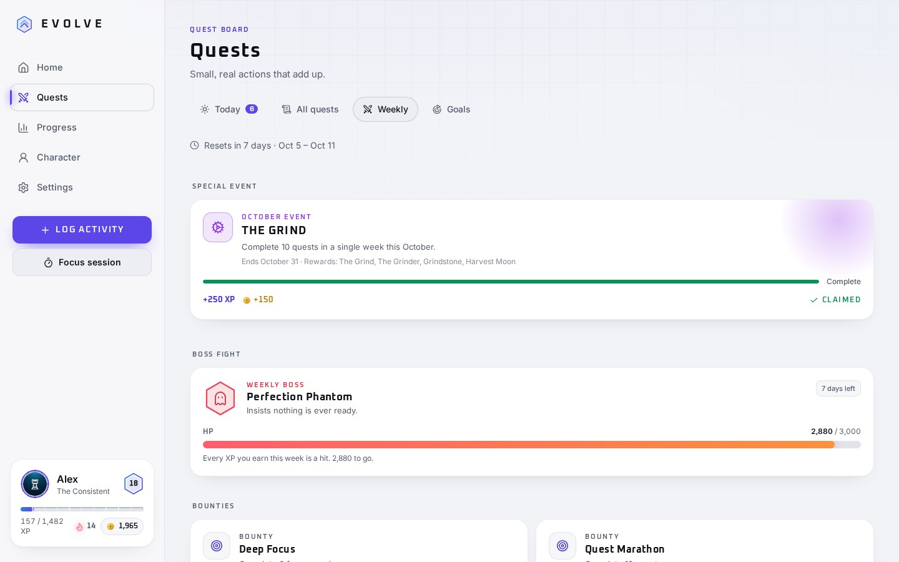

# Evolve — Real life. Now with XP.

Evolve turns real life into an RPG. Studying, training, reading, creating and other everyday
habits earn XP, level up your character, complete quests, unlock achievements and keep streaks
alive. It's built for **consistency, not intensity**: healthy limits, rest days and kind streaks
are part of the game.

It's a mobile-first Progressive Web App. It installs on iPhone, iPad, Android and desktop, works
fully offline, and keeps everything on your device.

**Play it:** https://ahmedps520-svg.github.io/Evolve/



| Quest board | Streaks | Light theme |
| --- | --- | --- |
|  |  |  |

## Features

**Core loop**
- **Onboarding in six screens.** Name, goals, difficulty (Casual / Normal / Hardcore) and class (Scholar, Athlete, Creator, Explorer, Strategist, Balanced). You start with 3 starter quests, an achievement and 100 coins.
- **Dashboard.** Shows your avatar, level, an animated XP bar, today's XP, quests, streak, daily goal and rank. Completing a quest pops the card, flies the XP into your bar with particles, and shows a "Quest complete" toast with undo.
- **Quests.** Daily quests are drawn from your goals and class. You can also create custom quests (repeating or one-off, with targets and focus timers). XP is capped per difficulty: Easy 20, Medium 50, Hard 100, Epic 250, Legendary 500.
- **Quest generator.** Turns "I want to get better at coding" into small, realistic quests. It runs locally on rules, and refuses or softens unhealthy goals ("study 20 hours a day").
- **Activity logging.** 15+ categories, each with its own XP per 10 minutes (all adjustable). Logging time also progresses any quest in that category.
- **Focus mode.** A full-screen timer with pause and resume. It survives backgrounding (time is based on timestamps) and won't pay XP for clock tricks or sessions under 5 minutes.

**Progression**
- **Level curve.** `XP to next level = round(40 + 60 × level^1.1)`, with Relaxed, Steep and Classic presets or your own formula. Levels are always recalculated from your XP history.
- **Level-ups.** A cinematic level-up screen and +50 coins (+150 every tenth level).
- **Momentum.** Back-to-back activities within 2 hours earn ×1.05, then ×1.10, capped at ×1.15.
- **Healthy limits.** Each category has daily caps: time past the soft cap earns half XP, past the hard cap none. Grinding and all-nighters are never rewarded.
- **Daily goal** with a +50 XP bonus, and a **rank** for the day (Rookie, Steady, Strong, Heroic, Legendary).
- **Weekly challenges** that reset automatically: a **weekly boss** whose HP is your weekly XP target, plus bounties.
- **Special events** are data-driven, for example "The Grind" in October. Rewards include exclusive cosmetics.
- **Streaks.** Daily, weekly-consistency, category and per-quest streaks, plus a year heatmap. Rest days bridge gaps, and one missed day can be covered by a retroactive rest day. A reset is kind: "Your progress isn't gone. Start a new streak today."
- **Achievements.** 52 across six rarities (Common to Mythic), including secret ones, with progress bars and unlock dates.
- **Character.** Six attributes, per-category skill levels, a class and titles ("AHMED THE CONSISTENT"). Customize sigil, background, frame, aura, badge, XP effect, UI effect and theme.
- **Coin shop.** Cosmetics only, for example Cyber Frame (500) and Golden XP Effect (1,000). Nothing affects progression and nothing costs real money.
- **Goals with milestones** that pay XP, plus a completion bonus.

**Reflection and social**
- **Journal** with moods and photos. Photos stay on the device. Entries appear on a timeline of your days.
- **"Today's adventure"** summary: XP, quests, streak, best category, achievements and daily goal.
- **Statistics.** XP over time, minutes by attribute, category share, weekday and hourly patterns, and the full XP transaction history. Every chart has a table view.
- **Optional party mode** with no accounts and no servers. Share a party card (a link or code) that contains only what you allow, optionally under an anonymous name like `Player_4821`. You get a friends-only leaderboard (weekly, monthly, all-time) and friendly weekly XP challenges: the winner earns +250 coins and everyone earns something.

**App quality**
- **PWA.** Manifest, service worker (offline app shell and precaching), install prompt with an iOS hint, iOS splash screens, app shortcuts, and an update prompt.
- **Notifications that respect you.** Generated on-device, at most three a day, quiet hours, and never while you're using the app.
- **Accessibility.**
  - Full keyboard support: shortcuts `L` log, `N` new quest, `F` focus, `1`–`5` to navigate.
  - Labelled controls, focus traps and live regions.
  - WCAG AA text contrast in every theme.
  - Reduced-motion and high-contrast modes.
  - Information is never carried by color alone.
- **Settings.** Profile, theme (dark, light, auto), accent themes, motion, intense effects, sound, haptics, notifications, difficulty, daily goal, week start and the XP system. Also privacy, JSON export and import, storage protection, and a reset that requires typing `RESET`.
- **Landing page and demo.** "View demo" loads a Level 18 hero with 12,480 XP, a 14-day streak, 73 quests and 18 achievements, simulated through the real engine.

> **Privacy:** Your progress stays on your device. There is no account, no tracking and no ads.
> Data leaves the device only when you export a backup or share a party card yourself.

## Getting started

Requires Node 22.12+ (Vite 8 and Vitest 5).

```bash
npm install
npm run dev          # http://localhost:5173
npm run build        # type-check + production build into dist/
npm run preview      # serve the production build (service worker enabled)
```

| Script | What it does |
| --- | --- |
| `npm run typecheck` | TypeScript project build (app, tests, e2e, config) |
| `npm test` | Unit tests (Vitest): game engine, persistence, backups, demo hero |
| `npm run test:e2e` | End-to-end tests (Playwright) on mobile and desktop against the production build |
| `npm run icons` | Re-render app icons, favicons and iOS launch screens |
| `npm run screenshots` | Re-capture manifest and README screenshots (run `npm run build` first) |

### Deploying

`npm run build` produces a fully static `dist/` folder. Assets use relative paths and routing uses
the URL hash, so it works on any static host at any path: GitHub Pages, Netlify, Vercel,
Cloudflare Pages, S3 or a USB stick behind a web server. Serve it over HTTPS (or `localhost`) for the
service worker and install prompt.

This repository deploys itself: every push to `main` runs `.github/workflows/deploy.yml`, which
builds the app and publishes `dist/` to the `gh-pages` branch. GitHub Pages serves that branch at
https://ahmedps520-svg.github.io/Evolve/ (Settings → Pages → Deploy from a branch → `gh-pages`, `/ (root)`).

### Installing the app

- **iPhone / iPad (Safari):** Share → *Add to Home Screen*.
- **Android (Chrome):** the in-app *Install* card, or ⋮ → *Install app*.
- **Desktop (Chrome / Edge):** the install icon in the address bar, or Settings → App → *Install*.

## How it's built

- **React 19 + TypeScript** (strict) on **Vite**, **Tailwind CSS v4** with CSS-variable design tokens, and **Framer Motion** through `LazyMotion` and `m` primitives.
- **Zustand** for state, **IndexedDB** via `idb` for storage, with localStorage and in-memory fallbacks. No backend.
- Screens and sheets are lazy-loaded. The service worker is generated at build time with a content-hashed precache list.

```
src/
  lib/engine/        Pure game engine: (state, input, now) → { state, events }
    gameEngine.ts    Every player action: logActivity, completeQuest, takeRestDay, purchaseItem…
    rewards.ts       awardXP, awardCoins, momentum, level-ups, daily goal
    quests.ts        generateDailyQuests, rollovers, repeat schedules
    achievements.ts  checkAchievements conditions and progress
    streaks.ts       updateStreak, category streaks, rest-day bridging
    weekly.ts        Weekly boss and bounties
  lib/xp.ts          calculateLevel, calculateRequiredXP, calculateXPProgress (the XP formula)
  lib/db/            IndexedDB adapter, diff-based persistence, backups, demo simulation
  data/              Categories, classes, achievements, cosmetics, events, quest templates
  components/        UI kit, game components (avatar, HUD, quest card), charts, effects, sheets
  pages/             Landing, onboarding, home, quests, progress, character, settings, focus
  pwa/               Service worker template and registration
e2e/                 Playwright specs
scripts/             Icon and screenshot generators
```

### Design notes

- **One engine, many screens.** Every rule lives in `src/lib/engine`, which has no React and is unit-tested with a fixed clock. Each action returns the new state plus a list of events (`xp`, `levelUp`, `achievement`, `questComplete`…). The UI turns those events into toasts, particles, sounds and modals.
- **The ledger is the source of truth.** Every XP or coin change is a transaction with its local date. Totals, levels, streaks and statistics are derived from the ledger, so deleting an activity or changing the level curve stays consistent.
- **Local dates everywhere.** Each record stores the local calendar day it happened on. Date arithmetic is DST-safe and travelling never breaks a streak.
- **Tuning the game.**
  - Quest XP and activity rates: Settings → XP system, or `src/data/difficulty.ts` and `src/data/categories.ts`.
  - The level curve: `src/lib/xp.ts`.
  - Achievements, cosmetics and events are plain data in `src/data/`.

## Data and backups

Settings → Your data → **Export JSON** downloads `evolve-backup-YYYY-MM-DD.json`. The file contains
your profile, settings, history, quests, achievements, goals, journal (including photos) and party.
**Import JSON** restores it: the file is validated, damaged entries are skipped, and you confirm
before anything is replaced. You can also restore from the first onboarding screen.

## Testing

- **Unit tests (Vitest)** cover XP math and curves, leveling, momentum, healthy caps, quests and rerolls, achievements, streaks and rest days, daily goals, weekly bosses, goals and milestones, focus sessions, purchases, persistence diffs, the IndexedDB round-trip, backups, and the demo hero across many dates. They run with `TZ=America/New_York` to exercise daylight-saving transitions.
- **End-to-end tests (Playwright)** run against the production build on a phone and a desktop profile. They cover:
  - onboarding, quest creation and completion, XP and level-ups, achievements and streaks;
  - daily goals, weekly challenges, statistics and goals with milestones;
  - the quest generator, journal photos, rest days, party codes and challenges, and the shop and wardrobe;
  - persistence across reloads, export, reset and import;
  - dark and light themes, high contrast, and both forced and system reduced motion;
  - offline use, manifest validity, keyboard shortcuts, and responsive layouts (no sideways scrolling on phone, tablet or desktop);
  - an automated accessibility audit (axe-core, WCAG 2.1 AA) of every screen in dark and light themes.

## License

Fonts: Inter and Oxanium (SIL Open Font License, see `src/assets/fonts/LICENSE.md`).
Icons: Lucide (ISC).
